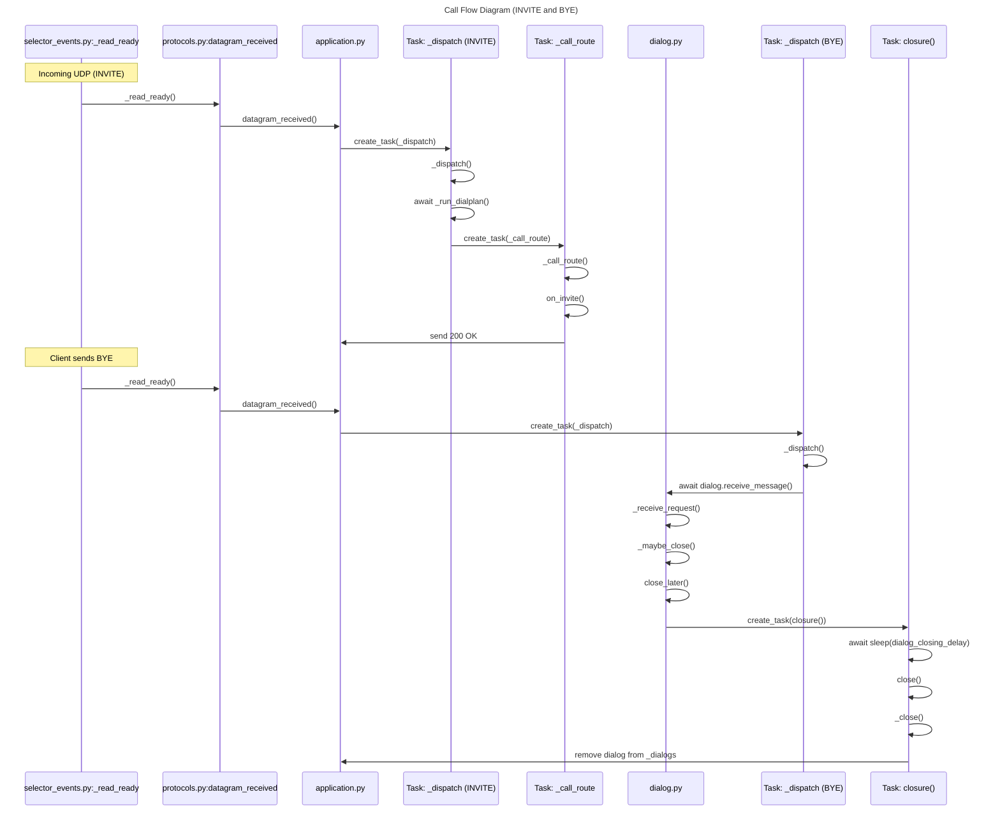

# 📞 Scenario: INVITE and BYE Call Flow

## Overview

The system handles SIP (Session Initiation Protocol) messages over UDP. Two key operations are illustrated: initiating a call with an INVITE and ending it with a BYE.

### INVITE Handling:

- When an INVITE request arrives via UDP, the system's selector detects the readable socket.

- The protocol layer reads the datagram and passes it to the application layer.

- The application schedules a dispatch task to handle the INVITE.

- This task executes the dial plan and initiates call routing logic.

- The call routing logic processes the INVITE and sends a 200 OK response to acknowledge and establish the call.

### BYE Handling:

- When a BYE request is received from the client, the flow begins similarly with the selector and protocol layers processing the datagram.

- The application dispatches the message and forwards it to the dialog handler.

- The dialog processes the BYE request, evaluates whether to close the dialog, and schedules its closure.

- A closure task is initiated, which waits for a short delay before performing cleanup.

- Finally, the dialog is removed from the application's internal state, completing the call termination process.

## Call Flow Diagram

